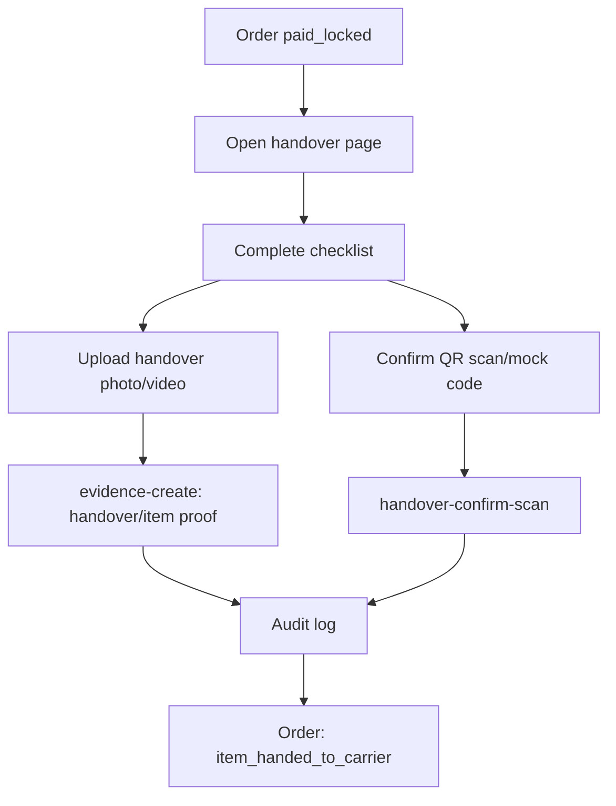
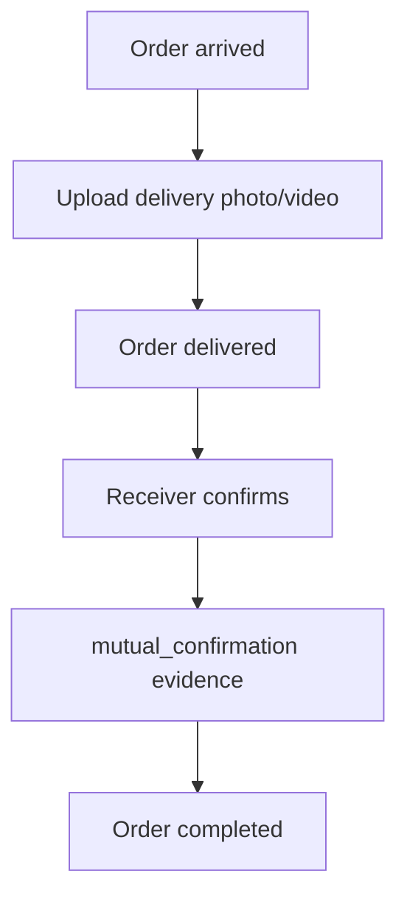
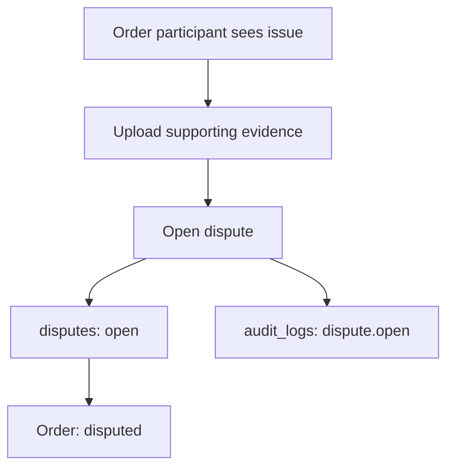

# Evidence And Dispute Flow

This document defines evidence requirements, dispute handling, and admin decision rules for the MVP.

Evidence is the platform's main trust mechanism. Every critical user action should create or reference evidence and audit logs.

## Evidence Rules

- Evidence records are append-only.
- Evidence must include `orderId`, uploader, type, canonical storage path (or an explicit non-file system marker), file ids/count, visibility, metadata, and timestamp.
- Users must not overwrite previous evidence.
- Important communications should stay inside the platform where possible.
- Dispute decisions must reference evidence ids and be logged.
- Frontend may collect files and descriptions, but backend/cloud functions create records.

## Evidence Types

| Type | Label | Typical uploader | Purpose |
|---|---|---|---|
| `item_photo` | 物品照片 | requester | Item condition before handover |
| `handover_qr_scan` | 交接扫码 | traveller/requester | Handover confirmation |
| `in_app_chat` | 站内沟通 | system | Relevant conversation record |
| `payment_record` | 服务费记录 | system | Payment/refund proof |
| `flight_record` | 行程凭证 | traveller | Flight/trip proof |
| `customs_or_airline_proof` | 海关/航司说明 | traveller/requester | Exceptional event proof |
| `delivery_photo_or_video` | 送达照片/视频 | traveller/requester | Delivery proof |
| `mutual_confirmation` | 双方确认 | requester/traveller/system | Completion proof |

## Evidence By Order State

| Order state | Required/expected evidence | Uploader | Timing |
|---|---|---|---|
| `draft` | none | none | before review/order creation |
| `pending_review` | `item_photo`, optional `flight_record` | requester/traveller | before approval |
| `approved` | review audit log | system/reviewer | at approval |
| `pending_payment` | none or payment intent record | system | before service-fee payment |
| `paid_locked` | `payment_record` | system | immediately after provider/mock confirmation |
| `item_handed_to_carrier` | `handover_qr_scan`, `item_photo` | both parties | at handover |
| `in_transit` | optional `flight_record`, `in_app_chat` | traveller/system | during trip |
| `arrived` | optional `flight_record` or arrival note | traveller | after arrival |
| `delivered` | `delivery_photo_or_video` | traveller/requester | at delivery |
| `completed` | `mutual_confirmation` | both parties/system | at final confirmation |
| `disputed` | relevant evidence bundle | opener/both parties | before/admin review |
| `cancelled` | cancellation reason audit log | actor/system | at cancellation |
| `refunded` | `payment_record`, decision log | system/admin | after refund |

## Handover Flow

Current implementation:

- Handover page collects checklist confirmation.
- The page requires linked `item_photo` evidence before confirmation.
- `handover-confirm-scan` creates `handover_records`, `handover_qr_scan` system evidence, and audit logs in one transaction.
- `handover-confirm-scan` advances the order from `paid_locked` to `item_handed_to_carrier`.
- Evidence upload preselects the user-uploadable `item_photo` type.

Required follow-up:

- Replace mock handover code with expiring server-generated code.
- Ensure both parties can see relevant handover evidence.

## Delivery And Completion Flow

Rules:

- `delivery_photo_or_video` should exist before or at `delivered`.
- `mutual_confirmation` should exist before or at `completed`.
- Completion should be blocked when an active dispute exists.

## Dispute Opening Flow

Current implementation:

- Dispute page requires reason and description.
- User can navigate to evidence upload before submission.
- `dispute-open` creates a `disputes` record and audit log.
- `dispute-open` advances the order to `disputed`.
- The page requires and passes at least one evidence id.
- `orders.activeDisputeId` prevents a second active dispute.

## Admin Review Flow

Admin decision must record:

- `adminOpenid`
- decision action
- reason
- evidence ids reviewed
- resulting order action
- timestamp

Allowed decision actions:

- `refund`
- `complete`
- `cancel_order`
- `keep_in_dispute`

Rules:

- Admin decision must not rely on off-platform evidence unless manually attached as evidence.
- Refund decisions apply to service fee only.
- Merchandise loss/damage compensation is not automatic and must not be promised.
- Any order state change caused by dispute decision must go through an audited backend function.
- `dispute-decide` is restricted to `admin`/`reviewer` and commits decision, order, evidence, Mock payment changes, and audit logs atomically.

## Evidence Visibility

| Visibility | Who can read |
|---|---|
| `both_parties` | requester, traveller, admin |
| `requester_only` | requester, admin |
| `traveller_only` | traveller, admin |
| `admin_only` | admin/reviewer only |

Default:

- Handover, delivery, mutual confirmation: `both_parties`
- Payment provider details: admin/system view; user-facing payment summary can be `both_parties`
- Sensitive review documents: `admin_only`

## Proof Standards

Item photo:

- Show full item, packaging, quantity, and visible condition.
- Request publication requires 1 to 6 images; each selected image is limited to 5 MB.
- The request page uploads images to CloudBase before calling `item-request-create`, which accepts only `cloud://` file ids.
- Request detail shows the submitted images for review and later comparison.
- New handover-condition photos should still be uploaded as append-only `item_photo` evidence before or at handover; the original request image must not be overwritten.

Handover proof:

- QR scan or confirmation code.
- Photo/video when possible.
- Checklist confirmation in app.

Flight/trip proof:

- Flight number and date.
- Ticket/boarding proof can be `admin_only` if sensitive.

Delivery proof:

- Photo/video at destination.
- Receiver confirmation or in-app message.

Customs/airline proof:

- Upload only when there is inspection, delay, loss, damage, tax, or airline issue.
- Use as supporting evidence, not as a platform customs guarantee.

## In-App Chat Evidence

Chat is bound to an accepted order and stored as append-only messages. A normal message does not create a separate `evidence` record.

When a dispute is opened or an authorized reviewer requests a transcript, `chat-evidence-snapshot` will:

1. Verify the order participant/admin and conversation ownership.
2. Select a bounded message-id/time range.
3. Create an immutable JSON or PDF transcript in CloudBase storage.
4. Record file id/storage path, message ids, time range, content hash, visibility, system uploader, and timestamp.
5. Create `evidence` with `evidenceType: "in_app_chat"` and write a metadata-only audit log.
6. Return the evidence id so it can be referenced by `disputes.evidenceIds`.

Admin-hidden or blocked messages remain available only according to admin evidence visibility. Generating a later snapshot creates a new evidence record and never modifies an earlier snapshot. See `docs/architecture/in-app-chat.md` for the complete design.

## Deployment Checklist

- Deploy all 33 cloud functions with `wx-server-sdk` 4.0.2.
- Create `evidence(orderId, createdAt)` and `disputes(status, updatedAt)` indexes.
- Verify CloudBase storage permissions for `evidence/{orderId}/{operationId}/...`.
- Test requester, traveller, and admin accounts through happy-path and dispute/Mock-refund paths.
- Deploy and test supervised order chat and `chat-evidence-snapshot` according to `docs/architecture/in-app-chat.md`.
