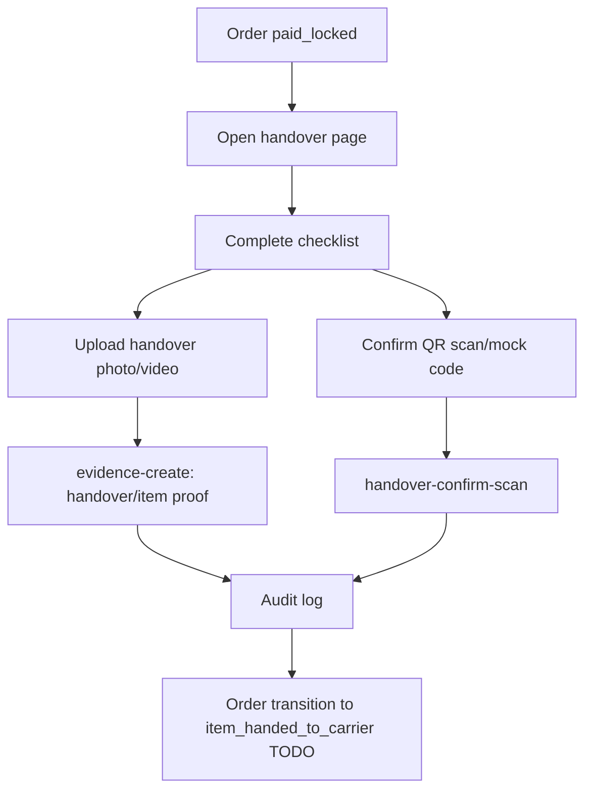
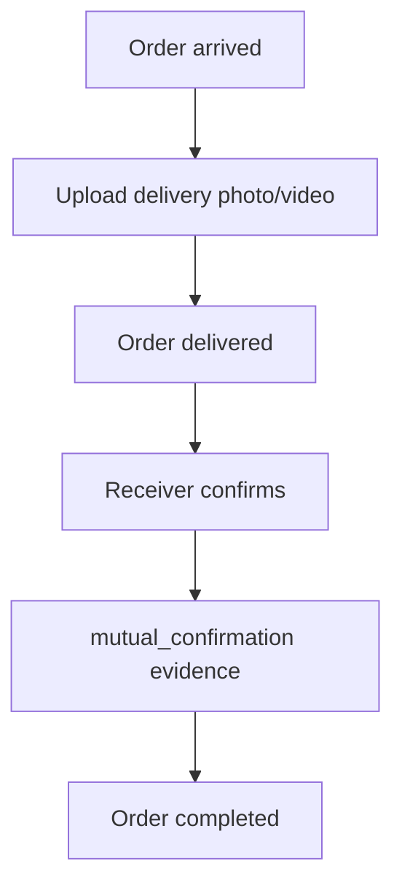
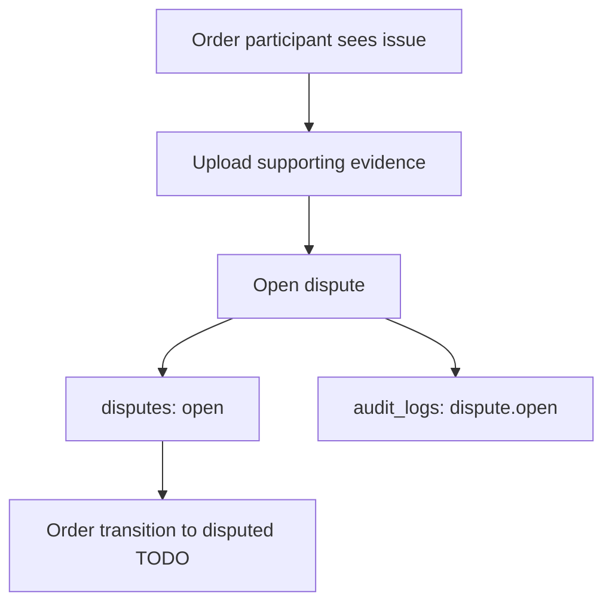
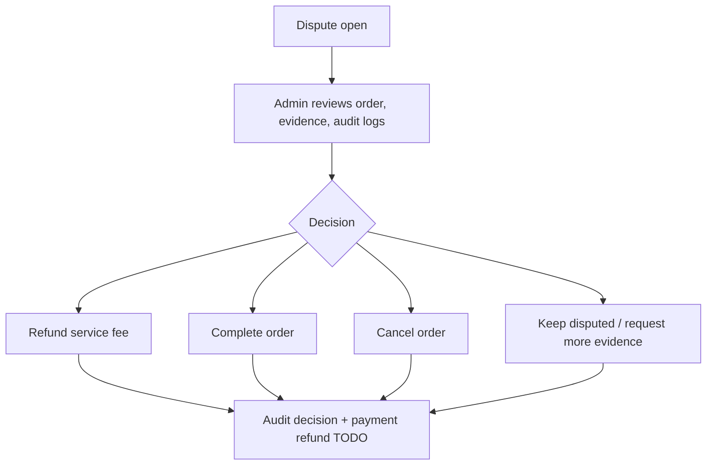

# Evidence And Dispute Flow

This document defines evidence requirements, dispute handling, and admin decision rules for the MVP.

Evidence is the platform's main trust mechanism. Every critical user action should create or reference evidence and audit logs.

## Evidence Rules

- Evidence records are append-only.
- Evidence must include `orderId`, uploader, type, file ids or file count, visibility, metadata, and timestamp.
- Users must not overwrite previous evidence.
- Important communications should stay inside the platform where possible.
- Dispute decisions must reference evidence ids and be logged.
- Frontend may collect files and descriptions, but backend/cloud functions create records.

## Evidence Types

| Type | Label | Typical uploader | Purpose |
|---|---|---|---|
| `item_photo` | 物品照片 | requester | Item condition before handover |
| `handover_qr_scan` | 交接扫码 | traveller/requester | Handover confirmation |
| `in_app_chat` | 站内沟通 | system | Relevant conversation record |
| `payment_record` | 服务费记录 | system | Payment/refund proof |
| `flight_record` | 行程凭证 | traveller | Flight/trip proof |
| `customs_or_airline_proof` | 海关/航司说明 | traveller/requester | Exceptional event proof |
| `delivery_photo_or_video` | 送达照片/视频 | traveller/requester | Delivery proof |
| `mutual_confirmation` | 双方确认 | requester/traveller/system | Completion proof |

## Evidence By Order State

| Order state | Required/expected evidence | Uploader | Timing |
|---|---|---|---|
| `draft` | none | none | before review/order creation |
| `pending_review` | `item_photo`, optional `flight_record` | requester/traveller | before approval |
| `approved` | review audit log | system/reviewer | at approval |
| `pending_payment` | none or payment intent record | system | before service-fee payment |
| `paid_locked` | `payment_record` | system | immediately after provider/mock confirmation |
| `item_handed_to_carrier` | `handover_qr_scan`, `item_photo` | both parties | at handover |
| `in_transit` | optional `flight_record`, `in_app_chat` | traveller/system | during trip |
| `arrived` | optional `flight_record` or arrival note | traveller | after arrival |
| `delivered` | `delivery_photo_or_video` | traveller/requester | at delivery |
| `completed` | `mutual_confirmation` | both parties/system | at final confirmation |
| `disputed` | relevant evidence bundle | opener/both parties | before/admin review |
| `cancelled` | cancellation reason audit log | actor/system | at cancellation |
| `refunded` | `payment_record`, decision log | system/admin | after refund |

## Handover Flow

Current implementation:

- Handover page collects checklist confirmation.
- `handover-confirm-scan` creates `handover_records` and an audit log.
- Evidence upload can preselect `handover_qr_scan`.

Required follow-up:

- Require evidence ids before transitioning to `item_handed_to_carrier`.
- Verify handover code ownership and expiry.
- Ensure both parties can see relevant handover evidence.

## Delivery And Completion Flow

Rules:

- `delivery_photo_or_video` should exist before or at `delivered`.
- `mutual_confirmation` should exist before or at `completed`.
- Completion should be blocked when an active dispute exists.

## Dispute Opening Flow

Current implementation:

- Dispute page requires reason and description.
- User can navigate to evidence upload before submission.
- `dispute-open` creates a `disputes` record and audit log.

Required follow-up:

- Include evidence ids in `disputes.evidenceIds`.
- Move order to `disputed` through `order-transition`.
- Prevent duplicate open disputes for the same active order unless admin allows it.
- Verify caller is an order participant.

## Admin Review Flow

Admin decision must record:

- `adminOpenid`
- decision action
- reason
- evidence ids reviewed
- resulting order action
- timestamp

Allowed decision actions:

- `refund`
- `complete`
- `cancel_order`
- `keep_in_dispute`
- `none`

Rules:

- Admin decision must not rely on off-platform evidence unless manually attached as evidence.
- Refund decisions apply to service fee only.
- Merchandise loss/damage compensation is not automatic and must not be promised.
- Any order state change caused by dispute decision must go through an audited backend function.

## Evidence Visibility

| Visibility | Who can read |
|---|---|
| `both_parties` | requester, traveller, admin |
| `requester_only` | requester, admin |
| `traveller_only` | traveller, admin |
| `admin_only` | admin/reviewer only |

Default:

- Handover, delivery, mutual confirmation: `both_parties`
- Payment provider details: admin/system view; user-facing payment summary can be `both_parties`
- Sensitive review documents: `admin_only`

## Proof Standards

Item photo:

- Show full item, packaging, quantity, and visible condition.
- Should be uploaded before or at handover.

Handover proof:

- QR scan or confirmation code.
- Photo/video when possible.
- Checklist confirmation in app.

Flight/trip proof:

- Flight number and date.
- Ticket/boarding proof can be `admin_only` if sensitive.

Delivery proof:

- Photo/video at destination.
- Receiver confirmation or in-app message.

Customs/airline proof:

- Upload only when there is inspection, delay, loss, damage, tax, or airline issue.
- Use as supporting evidence, not as a platform customs guarantee.

## Current Gaps

- Evidence upload currently sends `fileCount` fallback and does not upload cloud file ids yet.
- `in_app_chat` is listed but no chat/evidence extraction model exists.
- `payment-confirm-mock` does not create `payment_record` evidence yet.
- `dispute-open` does not pass evidence ids.
- Admin decision cloud function does not exist yet.
- Order state transitions are not yet evidence-gated.

## Implementation Checklist

- Add cloud file upload wrapper and persist `fileIds`.
- Add evidence picker shortcuts from order detail by evidence type.
- Add `payment_record` evidence on payment confirmation.
- Add active-dispute guard to completion.
- Add admin dispute decision cloud function.
- Add evidence requirements to `order-transition`.
- Add audit logs with `evidenceIds` and `operationId`.
