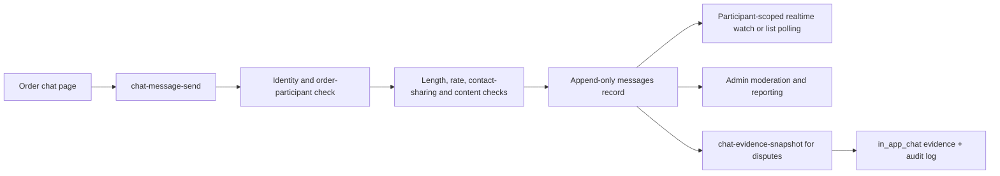

# In-App Chat Architecture

This document defines the supervised order chat implemented for the WeChat Mini Program MVP.

Implementation status: **implemented in the repository; CloudBase deployment/configuration required**. The Mini Program page, order entry, eight cloud functions, moderation, reporting/admin review, watch-to-poll fallback, and append-only transcript evidence are present. Before release, create collections/indexes, deploy functions, test participant-scoped reads, confirm WeChat content-security permission, and complete privacy/retention decisions.

## Architecture Decision

Use CloudBase collections, cloud functions, and database realtime `watch()` for the MVP.

- The product needs low-volume one-to-one order communication, not a general social or group-chat system.
- The existing backend already uses CloudBase identity, functions, database, storage, audit logs, and evidence records.
- All message writes go through cloud functions. The frontend never creates, edits, hides, or deletes message documents directly.
- Realtime `watch()` may be enabled only after participant-scoped read rules are tested. Until then, use paged `chat-message-list` calls with short foreground polling.
- Migrate to a dedicated IM service only when offline delivery, cross-device synchronization, richer media, or materially higher concurrency justifies the additional integration and moderation complexity.

References:

- [CloudBase database realtime push](https://docs.cloudbase.net/database/realtime)
- [Tencent Cloud IM Mini Program SDK](https://cloud.tencent.com/document/product/269/117335)
- [WeChat text content security check](https://developers.weixin.qq.com/miniprogram/dev/OpenApiDoc/sec-center/sec-check/security.msgSecCheck.html)

## Product Boundary

- Chat is bound to an accepted order through `orderId` and `conversationId`.
- Before an order exists, users communicate through structured offer messages and conditions. Free chat is not opened during public matching.
- Only the requester, traveller, and authorized admin/reviewer roles may access the conversation.
- Initial MVP chat is text-only. Item, handover, delivery, customs/airline, and dispute files continue to use the evidence upload flow.
- Chat must not be used to move merchandise payments off-platform, promise customs clearance, guarantee delivery, or replace order-state and evidence actions.
- The UI must tell users that messages are stored and may be reviewed for transaction safety and dispute handling.

## Runtime Flow

## Collections

### `conversations`

One conversation per order.

| Field | Type | Required | Notes |
|---|---|---:|---|
| `_id` | string | yes | Conversation id |
| `orderId` | string | yes | Unique order reference |
| `participantOpenids` | string[] | yes | Requester and traveller only |
| `status` | string | yes | `active`, `read_only`, `closed` |
| `lastMessageId` | string | no | Latest visible message |
| `lastMessagePreview` | string | no | Short, non-sensitive preview |
| `lastMessageAt` | Date | no | Server time |
| `createdAt` | Date | yes | Server time |
| `updatedAt` | Date | yes | Server time |

Indexes:

- unique `orderId`
- `participantOpenids`, `lastMessageAt`

### `messages`

Messages are append-only. Users cannot edit, recall, overwrite, or physically delete them.

| Field | Type | Required | Notes |
|---|---|---:|---|
| `_id` | string | yes | Message id |
| `conversationId` | string | yes | Conversation reference |
| `orderId` | string | yes | Denormalized for authorization and evidence |
| `participantOpenids` | string[] | yes | Supports participant-scoped reads |
| `senderOpenid` | string | yes | Taken from server context |
| `senderRole` | string | yes | `requester`, `traveller`, `system`, `admin` |
| `messageType` | string | yes | MVP: `text` or `system` |
| `content` | string | yes | Maximum 500 characters for user text |
| `moderationStatus` | string | yes | `visible`, `under_review`, `blocked`, `admin_hidden` |
| `moderationReason` | string | no | User-safe reason code, not secret rule details |
| `clientMessageId` | string | yes | Idempotency key generated by client |
| `orderStatusAtSend` | OrderStatus | yes | Related order state at server write time |
| `createdAt` | Date | yes | Server time only |

Indexes:

- unique `conversationId`, `clientMessageId`
- `conversationId`, `createdAt`
- `orderId`, `createdAt`
- `moderationStatus`, `createdAt`
- `conversationId`, `senderOpenid`, `createdAt` for rate limiting

### `message_receipts`

Stores per-user read progress without modifying message records.

| Field | Type | Required | Notes |
|---|---|---:|---|
| `_id` | string | yes | Receipt id |
| `conversationId` | string | yes | Conversation reference |
| `readerOpenid` | string | yes | Must be a participant |
| `lastReadMessageId` | string | no | Latest read message |
| `lastReadAt` | Date | yes | Server time |

Index: unique `conversationId`, `readerOpenid`.

### `message_reports`

Stores participant reports and moderation results.

| Field | Type | Required | Notes |
|---|---|---:|---|
| `_id` | string | yes | Report id |
| `orderId` | string | yes | Related order |
| `messageId` | string | yes | Reported message |
| `reporterOpenid` | string | yes | Participant openid or `system` for automatic moderation review |
| `reason` | string | yes | Stable reason code |
| `description` | string | no | User explanation |
| `status` | string | yes | `open`, `reviewing`, `resolved`, `dismissed` |
| `decision` | object/null | yes | Admin, reason, action, timestamp |
| `createdAt` | Date | yes | Server time |
| `updatedAt` | Date | yes | Server time |

Indexes:

- `status`, `createdAt` for the reviewer queue
- `messageId`, `reporterOpenid`, `status` for duplicate-report checks
- `orderId`, `createdAt`

## Cloud Functions

| Function | Purpose | Writes |
|---|---|---|
| `chat-conversation-get` | Get/create order conversation and initial system notice | `conversations`, `messages` when missing |
| `chat-message-list` | Participant-gated cursor pagination | none |
| `chat-message-send` | Validate, moderate and append a text message | `messages`, `conversations` |
| `chat-mark-read` | Update caller read progress | `message_receipts` |
| `chat-message-report` | Report a message for review | `message_reports`, `audit_logs` |
| `chat-review-queue-list` | List pending reports for the existing reviewer page | none |
| `chat-admin-review` | Hide/restore a message or resolve a report | `messages`, `message_reports`, `audit_logs` |
| `chat-evidence-snapshot` | Produce immutable transcript evidence for a dispute | cloud storage, `evidence`, `audit_logs` |

## Send And Moderation Rules

`chat-message-send` must perform these checks in order:

1. Read caller identity from `cloud.getWXContext()`.
2. Load the order and verify that the caller is requester or traveller.
3. Verify that the conversation belongs to the same order and is writable.
4. Enforce `clientMessageId` idempotency, message length, rate limits, and payload shape.
5. Detect phone numbers, WeChat/contact ids, QR-code instructions, external payment requests, prohibited-item negotiation, threats, and other risk patterns.
6. Call the WeChat text content security API server-side.
7. Store safe messages as `visible`; withhold uncertain content as `under_review`; store rejected content as `blocked` with participant-safe feedback.
8. Create a system-generated open `message_reports` row for `under_review` content so it appears in the reviewer page; an admin can approve/display it or keep it hidden.
9. Use server time and append a new record. Never update an older user message to represent a resend.

Blocked or reviewed content must not be copied into general `audit_logs`. Keep restricted moderation details in the message/report records and audit only the decision metadata required for accountability.

## Realtime And Pagination

- Load history through `chat-message-list` using a stable `(createdAt, _id)` cursor and a bounded page size.
- Subscribe only to the active `conversationId` and visible messages.
- Close the watcher in page `onUnload` and before creating a replacement watcher.
- On watch failure or when participant-scoped database rules are not deployed, fall back to foreground polling.
- Never make the entire `messages` collection publicly readable to enable realtime behavior.

## Evidence Snapshot

Chat messages are transaction records, but they do not each create an `evidence` row. When a dispute is opened or an admin requests a snapshot:

1. `chat-evidence-snapshot` verifies the order participant/admin role.
2. The backend selects a bounded message-id/time range and includes visible plus moderation-relevant records according to admin visibility.
3. It writes a JSON or PDF transcript to CloudBase storage, recording its storage path and content hash.
4. It creates append-only `evidence` with `evidenceType: "in_app_chat"`, `orderId`, system uploader, file id/path, visibility, message ids, time range, hash, and creation time.
5. It writes `audit_logs` without duplicating the full transcript content.

This snapshot can be referenced by `disputes.evidenceIds`. Later message hiding does not alter an existing snapshot.

## Frontend Implementation

- `pages/chat/index` is opened from order detail.
- Show the order item/route context and the supervision notice near the top.
- Support loading, empty, reconnecting, sending, sent, blocked, under-review, and read-only states.
- Keep the composer above the safe area and disable it while sending.
- Show one clear report action per message without exposing administrator controls.
- Do not render raw openids, moderation internals, payment secrets, or private admin notes.
- Do not add image/video chat in the first implementation; link users to the evidence upload page for transaction files.

## Retention And Privacy

- Declare chat collection, moderation, storage, dispute use, visibility, and retention in the Mini Program privacy disclosure before release.
- Retention duration and deletion/anonymization policy require an explicit product/legal decision before production launch.
- Users may hide a conversation locally, but this must not delete transaction or evidence records.
- After the configured order/dispute window, make the conversation read-only; do not silently remove it from admin evidence review.

## Deployment And Completion Checklist

- [ ] Create collections and indexes.
- [ ] Implement participant-scoped permissions and test both parties, third parties, and admins.
- [x] Implement the eight cloud functions above.
- [x] Add server-side text content security call with fail-closed `under_review` behavior and function permission manifest.
- [x] Build the order chat page and order-detail entry.
- [x] Implement watcher cleanup, polling fallback, pagination, and idempotent resend handling.
- [x] Implement report/admin-review queue/actions and audit logging.
- [x] Implement `in_app_chat` evidence snapshot and optional dispute linking.
- [ ] Deploy and verify WeChat content-security permission and moderation outcomes in the target environment.
- [ ] Update privacy disclosure and decide retention policy.
- [ ] Add automated authorization, moderation, evidence, and negative tests.
