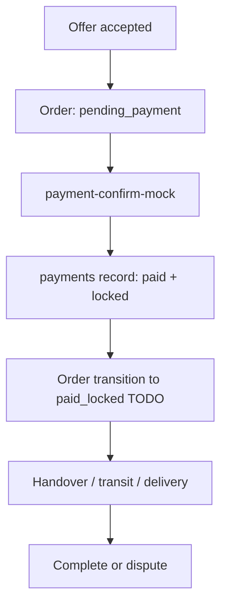

# Payment And Refund Boundary

This document defines the MVP payment and refund boundary for the cross-border carrying Mini Program.

The platform only records and processes the carrying service fee. It does not hold merchandise payments, does not buy goods on behalf of users, and does not operate a cross-border payment or funds-pooling service.

## Non-Negotiable Boundary

- Do not implement platform-held merchandise payment.
- Do not call the service fee an escrow for goods.
- Do not promise guaranteed delivery, customs clearance, tax outcome, or full platform compensation.
- Do not store payment provider secrets in Mini Program frontend code.
- Do not let frontend code decide payment success, refund eligibility, settlement release, or dispute outcome.
- Keep real payment integration behind backend/cloud functions and provider callbacks.

## Money Types

| Money type | MVP support | Notes |
|---|---:|---|
| Carrying service fee | yes | Quoted by traveller, recorded in `offers.serviceFeeQuote`, paid through mock/provider interface |
| Platform service fee | yes | Calculated in backend-compatible fee breakdown |
| Merchandise payment | no | Users must not pay item purchase price through the platform |
| Customs duties/tax | no custody | Rule text and evidence only; default payer currently requester |
| Compensation/insurance | no | Do not promise full compensation |
| Refund | placeholder | Service-fee refund record only, provider-driven or admin/manual TODO |

## Current MVP Flow

Current implementation:

- `offer-create` records a service-fee quote.
- `offer-accept` creates an order in `pending_payment`.
- `payment-confirm-mock` creates a `payments` record with `provider: "mock"`, `paymentStatus: "paid"`, and `lockStatus: "locked"`.
- `order-transition` supports `pending_payment -> paid_locked`, but `payment-confirm-mock` does not yet call it.

Required next fix:

- After successful mock payment, call an audited backend transition to `paid_locked`, or make `payment-confirm-mock` perform the transition atomically.

## Payment Records

Collection: `payments`

Required fields:

- `orderId`
- `provider`: `mock`, `wechat_pay`, or `provider_todo`
- `providerPaymentId`
- `amount`
- `currency`
- `paymentStatus`
- `lockStatus`
- `refundStatus`
- `createdByOpenid`
- `createdAt`
- `updatedAt`

Payment status:

- `pending`: created but unpaid
- `paid`: provider/mock confirms payment
- `failed`: payment failed
- `cancelled`: user/provider cancelled

Lock status:

- `none`: not locked
- `locked`: service fee is held by provider/mock state
- `released`: service fee has been settled or released by provider/manual action

Refund status:

- `none`
- `requested`
- `approved`
- `refunded`
- `rejected`

## Real Payment TODO

Before enabling real payment:

1. Choose compliant provider setup for service-fee payment.
2. Confirm legal/payment-provider handling of held service fees, splitting, settlement, and refund.
3. Implement a provider callback cloud function.
4. Verify provider callback signature server-side.
5. Add idempotency with `operationId` or provider transaction id.
6. Update `payments` and `orders` in a single auditable backend operation.
7. Add audit logs for payment creation, confirmation, refund request, refund result, and settlement result.
8. Add admin/reviewer authorization checks for manual overrides.

Do not add real provider credentials to frontend code.

## Refund Conditions

Refund decisions apply to the service fee only.

| Order state | Default refund behavior | Notes |
|---|---|---|
| `pending_payment` | no payment to refund | Cancel order if needed |
| `paid_locked` | eligible before handover | Refund may be allowed if no handover happened |
| `item_handed_to_carrier` | manual review | Item has changed custody |
| `in_transit` | manual review/dispute | Evidence required |
| `arrived` | manual review/dispute | Evidence required |
| `delivered` | usually not automatic | Use mutual confirmation or dispute |
| `completed` | not automatic | Admin exception only |
| `disputed` | admin decision | Evidence and decision required |
| `cancelled` | depends on stage | Before handover normally eligible |
| `refunded` | already refunded | Terminal refund state |

Refund inputs:

- `orderId`
- current order state
- payment record
- cancellation/dispute reason
- evidence ids
- admin/reviewer decision when required

Refund outputs:

- updated `payments.refundStatus`
- order transition to `refunded` when applicable
- audit log with reason, actor, previous/next status, and evidence ids

## Settlement Placeholder

Settlement means releasing the service fee according to provider or manual admin process. It is not implemented in the MVP.

Allowed placeholder states:

- keep `payments.lockStatus: "locked"` until completed/disputed flow is defined
- record `lockStatus: "released"` only from a backend/admin/provider function
- add `audit_logs` for any release decision

Settlement must not:

- imply platform custody of merchandise payment
- run from frontend-only action
- happen without checking order state and dispute status

Future settlement release candidates:

- `completed` with mutual confirmation
- admin decision after dispute
- manual provider payout action after compliance approval

## Required Audit Logs

Create audit logs for:

- offer accepted into order
- payment created
- payment provider callback confirmed
- order moved to `paid_locked`
- refund requested
- refund approved/rejected
- provider refund completed
- settlement released
- admin manual override

Minimum audit fields:

- `actorOpenid`
- `actorRole`
- `targetType`
- `targetId`
- `action`
- `before`
- `after`
- `reason`
- `evidenceIds`
- `operationId`
- `createdAt`

## UI Copy Rules

Use:

- "服务费"
- "服务费记录"
- "Mock 支付"
- "服务费已锁定"
- "待接入合规支付服务"

Avoid:

- "商品货款托管"
- "平台担保商品款"
- "保证送达"
- "保证清关"
- "全额赔付"
- "自动放款" before provider/legal confirmation

## Implementation Checklist

- `payment-confirm-mock` creates payment audit log.
- `payment-confirm-mock` or a payment callback transitions order to `paid_locked`.
- Refund cloud function added with state checks.
- Settlement cloud function added as TODO/admin-only placeholder.
- Payment provider callback validates signatures.
- Frontend payment page remains display + cloud function call only.
- Tests cover illegal state transitions and duplicate callbacks.
